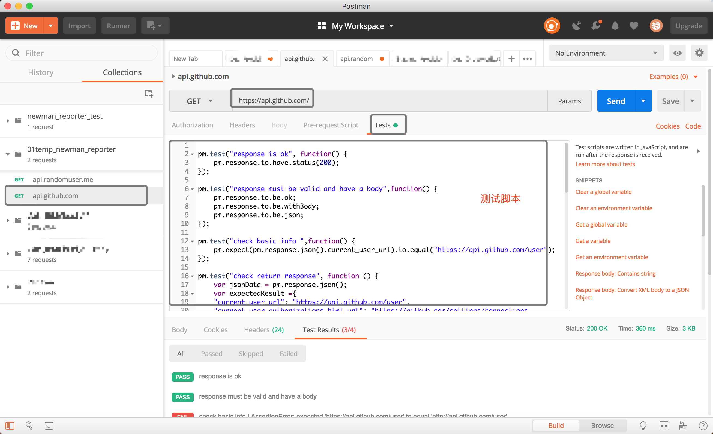
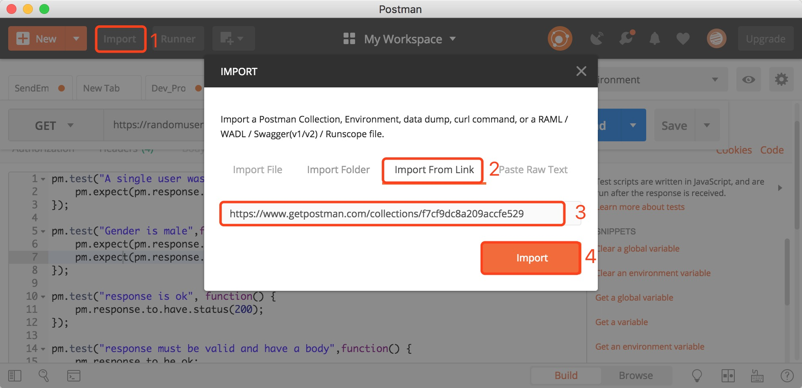
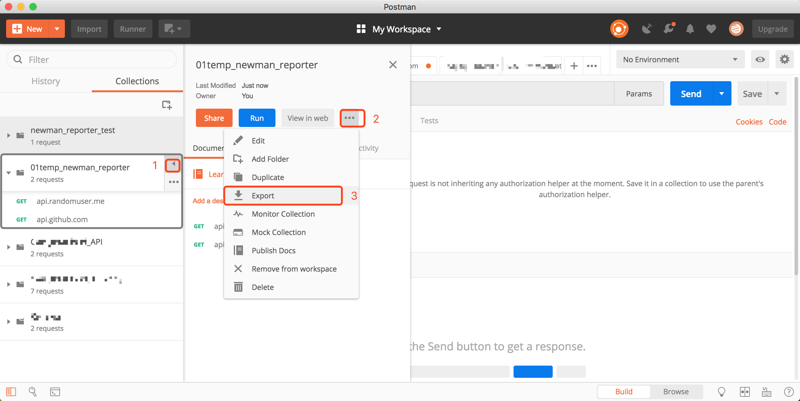
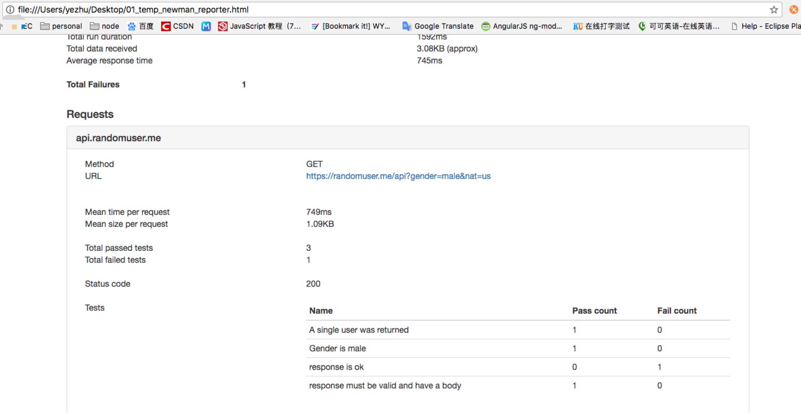

## 使用newman为postman中的测试结果生成测试报告

---
1 首先，在postman的Test中为api编写测试脚本代码，如图

 

如何在postman中如何写规范测试报告，可以参考博客[Writing tests in Postman](http://blog.getpostman.com/2017/10/25/writing-tests-in-postman/)

---
2 其次，把postman的测试脚本导出为json。为方便大家测试，我把上图中api的collection分享一份，大家可以按照下图的步骤导入链接即可,链接如下。
>https://www.getpostman.com/collections/f7cf9dc8a209accfe529

操作如图所示：



---
1⃣️将脚本导出为json文件，如图。



导出时选择 'Collection v2.1 (recommended)' ，然后确定生成的json文件的位置。我导出的json文件放在了桌面上
/Users/yezhu/Desktop/01_temp_newman_reporter.json

---
2⃣️在terminal或者命令行中newman命令生成测试报告
``` java
newman run /Users/yezhu/Desktop/01_temp_newman_reporter.json  --reporters html --reporter-html-export /Users/yezhu/Desktop/01_temp_newman_reporter.html

```
其中/Users/yezhu/Desktop/01_temp_newman_reporter.html 是生成的文件的名称和位置。

---

3⃣️ 生成之后直接打开，如图，


---

补充:
如果在生成reporter过程中报错提示
> newman: "html" reporter could not be loaded.
  run `npm install newman-reporter-html`

需要加载html模块，可以在命令行中运行以下命令：
``` java
sudo npm install -g newman-reporter-html
```
- `sudo` 是以root/Administrator权限来运行
- `-g`   是指全局安装，将安装包放在 /usr/local 下或者node的安装目录，以便可以直接在命令行里使用；不带则是安装在当前目录。
---


